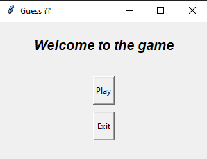
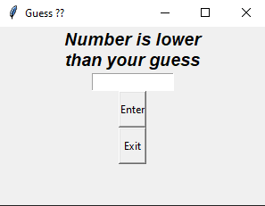

# Read Me
This Function creates a number with random module and gives you 3 chance and wants you to know the number
# Usage
just run " python guess_number.py " 
# Showcase
   
## Author
Furkan Sarsilmaz